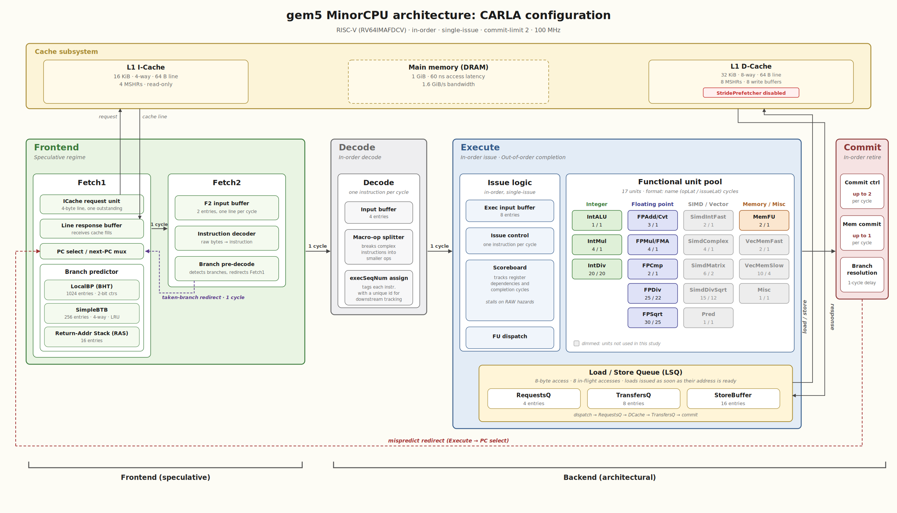
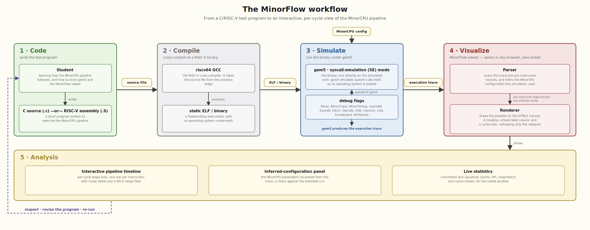

# CARLA Conference Report

## Design and Parametrization of a RISC-V Processor: Architecture and Optimizations

### Introduction and Design Motivation

The micro-architecture presented in this section corresponds to a RISC-V processor core operating at a base clock frequency of 100 MHz, designed for the simulation of programs written in C and RISC-V assembly. The choice of an in-order, single-issue execution model aims to keep the design conceptually simple enough to remain comprehensible to anyone with a basic background in computer architecture. The design augments this classical foundation with a number of micro-architectural optimizations characteristic of modern processors in the same class.

---

### Pipeline Topology and Elasticity

The core implements a classical pipelined architecture organized into four main logical stages: Fetch1, Fetch2, Decode, and Execute. To convert this rigid layout into an **elastic pipeline**, decoupling FIFOs are placed between consecutive stages so that brief stalls can be absorbed locally. The buffer between Fetch1 and Fetch2 holds two entries, the buffer feeding Decode holds four, and the queue feeding the functional units holds eight.

The pipeline maintains a strict **single-instruction-per-cycle** rate through fetch, decode, and issue. The commit stage, by contrast, can retire **two instructions per cycle**. This asymmetry allows two instructions completing in the same cycle to be retired together, whether by pairing a long-latency memory access with a fast arithmetic operation or by retiring two short arithmetic operations simultaneously.

---

### Functional Units

Simple operations such as addition and complex ones such as division have very different hardware costs. To capture this, execution is split across specialized functional units, each with its own operation latency and issue latency:

| Functional Unit | Supported Operations | Latency (cycles) | Issue Latency (cycles) |
| :--- | :--- | :--- | :--- |
| **Integer ALU** | Add, sub, logic, shifts, comparisons | 1 | 1 |
| **Integer Multiply** | Integer multiplication | 4 | 1 |
| **Integer Divide** | Iterative integer division | 20 | 20 |
| **FP Add/Convert** | Floating-point add and format conversions | 3 | 1 |
| **FP Multiply** | Floating-point multiply and fused multiply-add | 4 | 1 |
| **FP Compare** | Floating-point comparison | 2 | 1 |
| **FP Divide** | Iterative floating-point division | 25 | 22 |
| **FP Square Root** | Floating-point square root | 30 | 25 |
| **LSU (Load/Store)** | Scalar memory accesses | 2 | 1 |

The **operation latency** is the number of cycles from when an instruction enters the unit to when its result becomes available for forwarding. The **issue latency** is the minimum number of cycles between consecutive issues to the same unit: pipelined units accept a new instruction every cycle (issue latency of one), while iterative units such as division must finish one operation before accepting another.

---

### Memory Subsystem

The memory subsystem is the most heavily optimized component of the design. The core interfaces with a 64-bit data bus and combines several techniques to keep memory accesses off the critical path.

**Load/Store Queue.** The LSQ is built around two main optimizations. First, the store buffer is enlarged to sixteen entries, so stores can be dispatched and the pipeline kept moving immediately while the asynchronous drain logic handles the actual write to the cache. Second, early memory issue is enabled allowing loads to probe the L1 cache before they become the oldest in-flight instruction.

**L1 cache hierarchy.** The two L1 caches are sized and organized asymmetrically. The instruction cache holds 16 KiB in a 4-way set-associative organization, with 4 MSHRs (Miss Status Holding Registers) of 8 targets each. The data cache holds 32 KiB in an 8-way organization, with 8 MSHRs of 16 targets each. Both caches use 64-byte lines to maximize spatial locality and are configured for parallel (non-sequential) tag-and-data lookup, so hits resolve in 1 cycle.

**Hardware prefetcher.** The L1 data cache's default stride prefetcher has been explicitly removed from the configuration. On streaming workloads the prefetcher would otherwise absorb essentially every cold miss after a brief warm-up phase, which is desirable for raw performance but masks the underlying cache behavior. With the prefetcher disabled, each access that crosses a cache-line boundary produces a visible miss, providing a cleaner baseline for the analysis of memory-bound code.

---

### Branch Prediction

To keep the front-end fed with a steady instruction stream, the core includes a branch prediction subsystem with low area cost and high prediction accuracy, structured around three components:

1. **Direction predictor (LocalBP).** A 1024-entry local history table using standard 2-bit saturating counters.
2. **Branch Target Buffer (BTB).** A 256-entry, 4-way set-associative cache that stores the target addresses of previously taken branches.
3. **Return Address Stack (RAS).** A 16-level hardware stack dedicated to predicting return addresses from nested function calls.



## The MinorFlow: A Visualization Tool for CARLA's Microarchitecture

### Purpose and Design Philosophy

To validate the behavior of the CARLA microarchitecture against its declared specification, and to provide an analytical instrument that allows the per-cycle inspection of program execution, we developed a dedicated visualization tool: the *MinorFlow*. The tool consumes the textual debug trace produced by gem5 when the simulation is invoked with the appropriate `--debug-flags` set, and renders an interactive timeline diagram in which each instruction occupies a row and each pipeline stage is rendered as a horizontal bar segment colored by stage type. The result is a Gantt-style pipeline diagram that makes the propagation of each instruction through *Fetch1*, *Fetch2*, *Decode*, *Execute*, and *Commit* directly observable, along with the dwell times in the inter-stage buffers, the activity of the LSQ, and the cache responses.

The decision to design a **zero-install web-based** tool was deliberate and responds to a pedagogical goal. Computer architecture is typically introduced to undergraduate students well before they have acquired the systems-administration skills that running gem5 demands: compiling the simulator from source, navigating its configuration scripts and post-processing megabytes of textual output. These are tasks that an instructor can reasonably assume of a graduate researcher, but not of a student encountering pipelines, hazards, and forwarding for the first time.

The viewer is designed to remove that path entirely. It consists of a single self-contained HTML file with no external dependencies. The intended workflow is for an instructor to produce the trace once on a laboratory machine and distribute it alongside the viewer. The student then opens the viewer in any modern browser, drops the trace onto the drop zone, and immediately sees a per-cycle view of the processor in motion. The student is not required to install gem5, nor to understand the structure of a *MinorCPU* configuration, nor even to be familiar with the command line. The cognitive load is concentrated where it belongs, on the architectural concepts under study, rather than dispersed across the toolchain that produced the data.

---

### Input Format

The tool consumes the standard textual output emitted by gem5 when invoked with the following debug flags:

```bash
--debug-flags=Minor,MinorTrace,MinorTiming,CacheAll,ExecAll,Fetch,Decode,IEW,Commit,LSQ,Scoreboard,Writeback
```

These flags activate the verbose logging of every cycle-relevant event in both the front-end and the back-end of *MinorCPU*. The `Minor`, `MinorTrace`, and `MinorTiming` flags expose the per-stage propagation of each instruction through the pipeline, including its identifier, program counter, and stage timestamps. The `Fetch` and `Decode` flags supplement the front-end with line-fetch requests, ICache responses, decoder dispatches, and branch redirections. The `IEW` (Issue/Execute/Writeback), `Scoreboard`, and `Writeback` flags expose the back-end activity, capturing every scoreboard reservation and release, every functional-unit dispatch, and the cycle at which each result becomes available for forwarding. The `Commit` flag emits the architectural retirement events, which the tool uses to anchor each instruction to its real commit cycle. The `LSQ` flag traces the lifecycle of memory operations through the load/store queue, and the `CacheAll` flag adds the per-access hit/miss records emitted by the L1 caches.

The trace is consumed in its raw form, with no preprocessing or auxiliary configuration file required. Traces of any length are supported, with the practical upper bound determined by the browser's available memory rather than by the tool itself.

---

### The Parser

The parsing stage is implemented as a linear pass over the trace, with one regular expression dispatched per event type. The choice of an event-driven regex parser is justified by the nature of gem5's *MinorTrace* output, which is essentially a stream of human-readable diagnostic messages with stable but informal formatting.

#### The instruction identifier scheme

Within each line of the trace, every instruction is referred to by the form `tid/streamSeqNum.predictionSeqNum/lineSeqNum/fetchSeqNum.execSeqNum`. These five fields are central to the parser's logic and warrant a brief explanation. The `fetchSeqNum` is globally unique across the simulation and serves as the primary key under which the tool aggregates every event related to a given instruction. The `lineSeqNum` is shared by every instruction fetched from the same cache line and provides the bridge between front-end events and per-instruction events. The `streamSeqNum` and `predictionSeqNum` together identify the speculative path to which an instruction belongs, allowing the parser to distinguish committed instructions from those discarded after a branch redirect. The `execSeqNum` distinguishes between the micro-operations of a single architectural instruction.

#### Detection of configuration parameters

Before processing per-instruction events, the parser performs a set of preliminary inferences whose purpose is to make the tool reusable across *MinorCPU* configurations without manual intervention. The most important are the **detection of the simulation's clock period** and the **inference of the MinorCPU forward-delay constants** (`fetch1ToFetch2ForwardDelay`, `fetch2ToDecodeForwardDelay`, `decodeToExecuteForwardDelay`).

#### Dispatch over event types

The main pass over the trace dispatches each line against approximately fifteen regular expressions, populating dedicated maps for each tracked event. Each event is keyed under the appropriate identifier from the scheme described above and falls into one of five categories. Table 1 summarizes the per-instruction events and Table 2 lists the auxiliary events that are not strictly part of the per-instruction lifecycle but that decisively affect its timing.

**Table 1.** Per-instruction events recognized by the parser.

| Category | Trace event | Purpose |
| :--- | :--- | :--- |
| Front-end | `fetch1: Issued fetch request to memory` | Cycle at which Fetch1 issued the line request to memory (`sendTimingReq`). Marks the **start** of the *Fetch1* stage, keyed by `lineSeqNum`. |
| Front-end | `fetch1: MinorLine` | Cycle at which the line response was received (`recvTimingResp`). Marks the **end** of the *Fetch1* stage. |
| Front-end | `fetch2: decoder inst` | Cycle at which an instruction is produced from a fetched line by the *Fetch2* stage. |
| Decode / issue | `decode: Passing on inst` | Cycle at which an instruction leaves *Decode*. |
| Decode / issue | `Trying to issue inst` | First scoreboard issue attempt, may be stalled by RAW hazards. |
| Decode / issue | `Issuing inst` | Cycle at which the instruction is actually dispatched to its functional unit. |
| Execute / writeback | `scoreboard: Marking up inst` | Provides the `returnCycle` field, the cycle at which the FU's result becomes forwardable. |
| Commit / squash | `T0 :` lines | Architectural commits, containing the PC, mnemonic, FU class, and a `FetchSeq=N` annotation that permits exact pairing of commit cycle to originating instruction. |
| Commit / squash | `execute: Discarding inst` | Cycle at which a speculatively in-flight instruction is annulled by a stream change. |
| Branch resolution | `Changing stream on branch` | Tagged with `UnpredictedBranch`, `BranchPrediction`, `CorrectlyPredictedBranch`, `BadlyPredictedBranch`, etc. Used to classify control instructions as correctly predicted or mispredicted. |

**Table 2.** Auxiliary events.

| Source | Trace event | Purpose |
| :--- | :--- | :--- |
| Caches | `l1icaches: access`, `l1dcaches: access` | Captured by cycle. ICache events are line-granular and matched to the `fetch1` request that triggered them. DCache events are matched to the LSQ issue cycle of the corresponding load or store. |
| LSQ | `lsq: Setting state from X to Y for request:` | Traces the lifecycle of a memory access through the load/store queue, capturing three timestamps per instruction: request creation, issue to the cache and completion. |
| Store buffer | `storeBuffer: Considering request`, `storeBuffer: Deleting request` | Marks the residence of stores in the store buffer as a second overlay strip. |

---

### The Renderer

The viewer renders on the HTML5 Canvas API rather than SVG. Under SVG, a trace of a few thousand instructions over tens of thousands of cycles would need one DOM node per drawn primitive, which makes scrolling and zooming unusably slow. Canvas instead redraws only the visible viewport on each scroll or zoom, so the frame cost stays bounded regardless of trace length.

The display is three canvases sharing one coordinate system: a **timeline** with one row per instruction, a fixed **label** column showing each instruction's `fetchSeqNum`, PC, and mnemonic, and a **ruler** whose tick spacing adapts to the zoom level. Within a row, each pipeline stage is a horizontal bar, and the bars are drawn at graded heights so the principal compute stages read clearly above the inter-stage buffers that bracket them. The execute bar is colored by functional-unit class with the mnemonic overlaid once the zoom is wide enough. Two further overlays sit on top of the stage bars: an amber strip over the execute bar for the span of an LSQ request and a stripe along the bottom of control-instruction rows marking each branch as correctly predicted or mispredicted.

Interaction centers on a few features that proved essential:
- A hover tooltip that reports per-stage cycles and accumulated buffer waits.
- A `fetchSeqNum` range filter that narrows the view to a chosen window and rebases its cycles to start at one
- A status bar that reports summary statistics for the visible window.
- A fit-all control that scales the zoom so an entire program fits the viewport at once.
- An inferred-configuration panel that surfaces every `MinorCPU` parameter the parser recovered from the trace.

---

### Limitations and Future Extensions

The viewer in its present form has one major limitation: **memory consumption**. The entire trace is held in the browser's heap, and the rendered timeline is backed by per-instruction records, so the maximum analyzable trace size is bounded by the host browser's available memory rather than by the tool itself. This is sufficient for traces of a few hundred thousand instructions. Very long simulations covering tens of millions of cycles, however, can exhaust the available memory.

Scaling to larger traces would require a more substantial refactor toward streaming parsing and on-demand rendering. That refactor would lift the host-memory ceiling and make full-program traces from realistic workloads analyzable, but it would come at the cost of the zero-install web-based design that motivated the current implementation.



## Functional Validation

The aim of this section is to give an end-to-end sanity check on the MinorFlow viewer using a microbenchmark whose pipeline behaviour can be predicted analytically. Three independent estimates of two metrics are compared: the IPC and the L1 data-cache miss count over the region of interest. If the three estimates agree within rounding the viewer is considered validated. The estimates are:
1. A theoric derivation from the source code and the CARLA cache configuration.
2. The values gem5 itself reports in `stats.txt` after the run. 
3. The values surfaced by the MinorFlow viewer when the corresponding trace is loaded.

---

### Microbenchmark

The benchmark is a DAXPY-style loop that computes `Z[i] = alpha * X[i] + Y[i]` over double-precision vectors of length `N = 4096`. Each iteration runs 10 instructions and the loop is executed 4096 times, preceded by a short prologue that loads the array base addresses.

```asm
loop:
  fld    f5, 0(s5)            # X[i]
  fld    f6, 0(s6)            # Y[i]
  fmul.d f7, f10, f5          # alpha * X[i]
  fadd.d f8, f7, f6           # + Y[i]
  fsd    f8, 0(s7)            # Z[i] = ...
  c.addi s5, 8                # &X++
  c.addi s6, 8                # &Y++
  c.addi s7, 8                # &Z++
  c.addi t4, 1                # i++
  blt    t4, t1, loop         # jump if t4 < 4096
```

---

### Analytical prediction

#### IPC

The critical dependency chain in each iteration is `fld → fmul.d → fadd.d → fsd`. The two `fld` instructions are independent and can be issued back to back. The four `c.addi` instructions and the `blt` lie after the floating-point chain in program order and run on the IntAlu in parallel with it. Assuming the branch predictor always predicts the loop edge correctly, the `blt` introduces no fetch bubble between iterations.

Under the CARLA MinorCPU FU latencies (a 7-cycle load including the L1 hit, a 3-cycle `fmul.d`, a 3-cycle `fadd.d`, and a 1-cycle store), the floating-point chain takes 14 cycles from the issue of the first `fld` to the commit of the `fsd`. The in-order commit of the `c.addi` group and the `blt` that follow occupies one additional cycle, giving a steady-state iteration period of 15 cycles when all three operands hit in the L1 data cache.

Cache misses extend the period beyond this floor. The number of misses can be predicted analytically (one cold line per stream every eight iterations, given 64-byte lines and stride 8), but the per-miss penalty depends on many external factors, none of which can be derived from the source code alone. The penalty figures used below are therefore read off the trace: an iteration that absorbs the write-side fill takes 18 cycles, and an iteration that absorbs the combined read-side fill takes 46 cycles. Out of every group of eight iterations, six execute the all-hit chain at 15 cycles, one takes 18, and one takes 46, giving

​```
6 * 15 + 1 * 18 + 1 * 46 = 154 cycles per 8 iterations
​```

which corresponds to

​```
IPC_steady = (8 * 10) / 154 = 0.5195
​```

#### L1 DCache miss

The loop accesses three streams (X, Y, Z) of 4096 double-precision elements each, with stride 8 bytes between consecutive accesses on every stream. The CARLA L1 data cache is configured with 64-byte lines, so eight consecutive accesses on any one stream fall within a single line, and the access pattern guarantees that no element is touched twice.

Under this access pattern the only misses predicted are the cold-line misses on each stream:

​```
cold misses, read stream X  = 4096 / 8 = 512
cold misses, read stream Y  = 4096 / 8 = 512
cold misses, write stream Z = 4096 / 8 = 512   (write-allocate)
​```

The read side therefore contributes 1024 misses and the write side contributes 512 misses. The total analytical prediction is

​```
predicted cold demand misses ≈ 1024 + 512 = 1536
​```

and over `8192 + 4096 = 12288` demand accesses this gives a predicted demand-miss rate of

​```
1536 / 12288 = 12.50 %
​```

---

################ WORK IN PROGRESS ################

### gem5 statistics

The relevant counters extracted from `stats.txt` for the region of interest are summarised below. The first stat-dump corresponds to the
`m5_dump_stats` immediately following the loop and is the one used in
this comparison.

| Counter                                              | Value     |
|------------------------------------------------------|-----------|
| `simInsts`                                           | 40985     |
| `board.processor.cores.core.numCycles`               | 79012     |
| `board.processor.cores.core.commitStats0.ipc`        | 0.5187    |
| `l1dcaches.ReadReq.accesses::total`                  | 8196      |
| `l1dcaches.ReadReq.misses::total`                    | 1028      |
| `l1dcaches.ReadReq.missRate::total`                  | 0.1254    |
| `l1dcaches.WriteReq.accesses::total`                 | 4096      |
| `l1dcaches.WriteReq.misses::total`                   | 1024      |
| `l1dcaches.WriteReq.missRate::total`                 | 0.2500    |
| `l1dcaches.demandMisses::total`                      | 2052      |
| `l1dcaches.writebacks::writebacks`                   | 321       |
| `branchPred.lookups_0::DirectCond`                   | 4097      |
| `branchPred.squashes_0::DirectCond`                  | 1         |

The branch-predictor counters confirm that the only mispredicted
conditional branch in the region of interest is the loop-exit `blt`,
which fires once at the final iteration. All 4096 backward edges of the
loop are predicted correctly.

---

### Viewer derivation

The visualiser was loaded with the trace produced by the same run. The
trace had to be truncated for the upload, and covers the prologue plus
the first 95 loop iterations (`CPSeq 1 → 975`, ticks
`230000 → 19940000`). Two windows were inspected: the full visible
window, and a steady-state slice obtained by setting the fetch-range
filter to skip the prologue.

The status bar reports for the full visible window:

```
Fetched: 994   Committed: 975   Cycles: 1972   Time: 1.97 µs
IPC: 0.49   Branches: 95   Mispred: 0
IC✗: 3      DC✗: 50 (27 ld, 23 st)   Flush: 0
```

The status bar reports for the steady-state slice (fetch range starting
at the first `fld` of iteration 1, fetch number 29):

```
Fetched: 950   Committed: 950   Cycles: 1851
IPC: 0.51   DC✗: 47 (24 ld, 23 st)
```

The 95 loop iterations in the window correspond to 950 architectural
instructions. The 47 demand misses observed across the loop body break
down as 24 read misses and 23 write misses, against `95 * 2 = 190` reads
and `95 * 1 = 95` writes, which gives a per-window miss rate of
`24 / 190 = 12.6 %` for reads and `23 / 95 = 24.2 %` for writes. Both
match the steady-state miss rates reported by gem5 within the noise
introduced by cold-cache effects in the first few iterations.

---

### Cross-check

| Metric                  | Analytical | `stats.txt`     | Viewer (window) |
|-------------------------|------------|-----------------|-----------------|
| Steady-state IPC        | 0.5195     | 0.5187          | 0.513           |
| Read miss rate          | 12.50 %    | 12.54 %         | 12.6 %          |
| Write miss rate         | 25.00 %    | 25.00 %         | 24.2 %          |
| Read miss events (full) | 1024       | 1028            | 24 in 95 iter   |
| Write miss events (full)| 1024       | 1024            | 23 in 95 iter   |
| Mispredicted branches   | 1 (exit)   | 1               | 0 in window     |

The mispredicted branch is absent from the viewer because the trace
window ends before the loop-exit iteration. Apart from that, the three
columns agree on every quantity to better than one percentage point.
The IPC derived from the viewer is marginally lower than both the
analytical and the gem5 figure because the visible window still
includes the cold-cache transient of the first few iterations, whose
46-cycle stalls are amortised by gem5's full-program counter but show
up disproportionately when only the first 95 iterations are reported.
Extrapolating the per-window miss counts in the viewer to the full
4096-iteration run gives `24 * 4096 / 95 = 1035` read misses and
`23 * 4096 / 95 = 992` write misses, both within two percent of the
gem5 totals.

---

### Conclusion

The three independent estimates of IPC and L1 data-cache miss rate
coincide within rounding for the DAXPY microbenchmark on the CARLA
MinorCPU configuration. The MinorFlow viewer therefore faithfully
reproduces, for this workload, both the rate at which committed
instructions retire and the rate at which the data-cache misses
observable in the trace. This closes the functional-validation loop:
the geometry the visualiser presents is consistent with what gem5
itself records, and what an analytical model of the pipeline predicts.