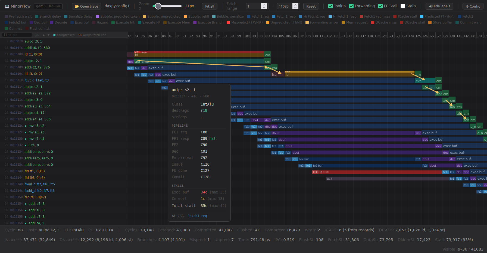

# MinorFlow

A browser-based pipeline visualizer for gem5's MinorCPU. It reconstructs the pipeline cycle by cycle from a gem5 debug trace and draws every instruction as a row, so you can see exactly where cycles are being lost.



## Motivation

gem5 tells you an instruction took a long time. It does not tell you why. The debug trace holds the answer, but a real workload produces hundreds of megabytes of it, and reading that by hand is not viable.

MinorFlow turns that trace into a picture. Each row is an instruction, each cell is a cycle in a stage, and the colour tells you what the core was doing: waiting on an instruction-cache fill, stalled behind a functional unit, held by the scoreboard waiting for an operand, or paying for a mispredicted branch.

## Quick start

Capture a trace from gem5:

```bash
gem5.opt --debug-flags=Minor,MinorTrace,MinorTiming,CacheAll,ExecAll,Fetch,Decode,IEW,Commit,LSQ,Scoreboard,Writeback \
         --debug-file=trace.txt \
         gem5_config.py
```

Convert it to JSON:

```bash
python3 MinorFlow_tracer.py m5out/trace.txt -o trace.json
```

Then open `MinorFlow.html` in any browser and drag `trace.json` onto the window. There is nothing to install and nothing to serve. The viewer is a single self-contained HTML file with no dependencies.

## Tracer options

```bash
python3 MinorFlow_tracer.py <trace> [-o OUT] [--stats] [--quiet]
```

| Option | Meaning |
| --- | --- |
| `trace` | Path to the gem5 MinorCPU debug trace (`.txt`, `.log`) |
| `-o`, `--out` | Output JSON path. Defaults to `<trace>.json` |
| `--stats` | Print a summary of committed and flushed instructions plus instruction-cache activity |
| `--quiet` | Suppress the progress output |

If the tracer parses zero instructions it will tell you so, which almost always means the trace was captured without the Minor debug flags.

## Why a separate tracer

The parser used to run in the browser. Large traces do not fit inside the browser's string-size and memory ceilings, so parsing moved to Python, where a trace is processed once, offline. The viewer loads the resulting JSON and does the windowing, the bubble and stall analysis, and the rendering. None of that logic is duplicated between the two.

## What the viewer shows

Per instruction, across its whole lifetime:

- **Fetch1**, request and response, with the request drawn red when the line misses the instruction cache and the fill time charged to the stage that waits for it. Instructions whose bytes span two fetch lines are drawn as two requests, so a line-spanning fetch is visible as such.
- **Fetch2**, where the branch predictor is consulted, with correct predictions and mispredictions distinguished.
- **Decode**, and the forward delay of each pipeline latch when the corresponding delay parameter is greater than one.
- **Execute**, including the wait ahead of a functional unit for the unit itself and for operands held by the scoreboard.
- **Commit wait** and **commit**, so in-order retirement pressure is visible.

Bubbles, front-end stalls, serialisation delays and branch delays each get their own colour and their own entry in the legend, with an explanation attached.

Plus the usual quality-of-life: fit-to-viewport zoom, a hover panel with per-instruction detail, and a PC search box that matches anywhere in the address and steps through hits across the whole fetch window rather than only the rows on screen. Every control has an in-app tooltip, so they are not repeated here.

Keys: `+` and `−` to zoom, arrows to navigate, `Home` and `End` to jump.

## Tested with

- **gem5 v25.0.0.1**, MinorCPU RISC-V model.
- A **ready-to-use Docker image** with gem5 already built, so you can produce traces without compiling anything:

```bash
docker pull manuel313/gem5_v25
```

Image: https://hub.docker.com/repository/docker/manuel313/gem5_v25/general

## Requirements

- Python 3, standard library only
- Any modern browser
- gem5 with the MinorCPU RISC-V model, for producing traces

## Related

[CVA6Flow](https://github.com/FaMAF-CVA6-Project/CVA6Flow) is the sibling tool. It visualises the CORE-V CVA6 RISC-V core running under Verilator, reconstructed from raw VCD signal dumps, and is deliberately built to look and behave like MinorFlow so that a simulated pipeline and a real RTL pipeline can be compared side by side.

Both come out of an undergraduate thesis at FaMAF, Universidad Nacional de Córdoba, asking how closely a gem5 MinorCPU configuration can be made to match a real RISC-V core.

## Licence

Released under the MIT Licence. See [LICENSE](LICENSE).
